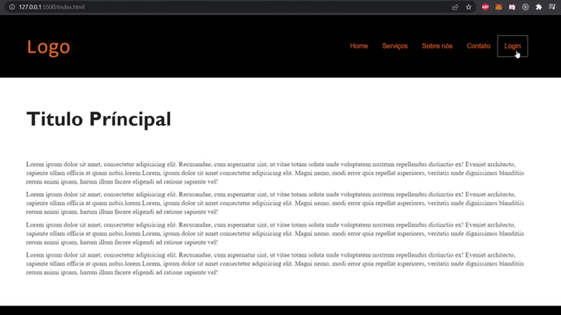

# Modal  📜

Modal simples de Login, apesar de ser um projeto bem simples, Ele é muito útil para treinar o seu CSS, animações com keyframes e manipulação do Dom com Javascript.

Você também pode visualizar ele pelo Pages do Github, por aqui:
https://joeljsilva.github.io/modal-css-javascript/

 

